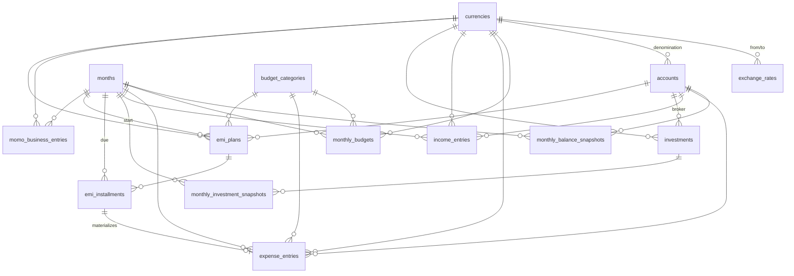

# Personal Finance Tracker — Database Schema

Step 1 deliverable. This document describes the SQLite schema defined in
`backend/src/main/resources/db/migration/V1__init.sql` and the seed data in
`V2__seed_reference_data.sql`.

## Conventions

- **Money**: stored as `INTEGER` minor units (cents). The display layer
  converts to decimal using `currencies.decimals`. This avoids float drift.
- **Timestamps**: `TEXT` in ISO-8601. `created_at` and `updated_at` default
  to `CURRENT_TIMESTAMP`; `updated_at` is maintained by triggers.
- **Dates**: `TEXT` as `YYYY-MM-DD`.
- **Month keys**: `months.id` is the canonical monthly FK. `effective_month`
  on `exchange_rates` is `YYYY-MM` text for simple keying.
- **Foreign keys**: require `PRAGMA foreign_keys = ON` (set per connection by
  the Spring datasource). ON DELETE rules follow ownership: snapshots cascade
  with their month; reference rows (categories, accounts, currencies)
  restrict to preserve history.

## Base currency & FX

- Base reporting currency = **CAD** (configured in `application.yml` in
  Step 2; not stored in the DB).
- `exchange_rates` rows are per `(from, to, effective_month)`. Entries may be
  `AUTO` (fetched on month init from exchangerate.host) or `MANUAL` (user
  override). Reporting always reads the `effective_month` matching the row
  being converted.

## ER diagram



## Table summary

| Table | Purpose |
|---|---|
| `currencies` | Supported currencies; code, symbol, decimals |
| `exchange_rates` | Per-month FX rates, `AUTO` or `MANUAL` source |
| `months` | Calendar month with `DRAFT`/`ACTIVE`/`LOCKED` status and integrity flag |
| `accounts` | Bank, cash, credit, investment holders (the "Master Roaster") |
| `monthly_balance_snapshots` | Opening + closing balance per account per month |
| `budget_categories` | 7 seeded personal-expense categories (extensible) |
| `monthly_budgets` | Per-month budget limit per category |
| `expense_entries` | Individual expense rows, with optional EMI link |
| `momo_business_entries` | Side-business (MOMO) sales/expense ledger |
| `income_entries` | Income receipts with free-text source |
| `investments` | Investment instruments (ETF/STOCK/MF/CRYPTO/BOND/…) |
| `monthly_investment_snapshots` | Shares + cost basis + market value per month |
| `emi_plans` | Installment plan definitions |
| `emi_installments` | Pre-materialized installment rows, auto-linked to expenses |

## Month lifecycle

```
DRAFT ──(init wizard complete)──▶ ACTIVE ──(finalize)──▶ LOCKED
```

- **DRAFT**: created by wizard; balances/budgets may be incomplete.
- **ACTIVE**: all wizard steps done, integrity_ok = 1, expenses/income editable.
- **LOCKED**: read-only. Enforced by service-layer `LockGuard` in Step 3.

## Integrity check

On month init, for each `account`:

```
prev.closing_amount  ==  curr.opening_amount
```

If all accounts match, `months.integrity_ok = 1`. The wizard UI displays a
side-by-side comparison (closing vs. opening) per account so the user can
reconcile before confirming.

## EMI projection

When an `emi_plans` row is created with `total_installments = N`, the service
pre-materializes N rows in `emi_installments`, one per future month, each in
status `PROJECTED`. On that future month's initialization, projected
installments for that month are turned into `expense_entries` (category
typically `MANDATORY`), and the installment row is linked via
`expense_entry_id`, status becomes `PAID`.

If a month is later **LOCKED**, only that month's installment freezes. Future
`PROJECTED` installments remain editable — plans can be extended, cancelled,
or re-amounted (matches user decision).

## Seed data (V2)

- **Currencies**: `CAD`, `USD`, `INR`, `NPR`.
- **Budget categories** (display order in parens):
  1. `MANDATORY` — Mandatory Expenses (10)
  2. `GROCERY` — Grocery (20)
  3. `HOUSEHOLD` — Household Items (30)
  4. `DINE_OUT` — Dine-out / Ordering (40)
  5. `PERSONAL_SHOPPING` — Personal Shopping (50)
  6. `UNPLANNED` — Unplanned Expenses (60)
  7. `MISC` — Miscellaneous (70)

No default budget amounts are seeded — limits are set each month via the init
wizard (and can be rolled over from the previous month).

## Out of scope for Step 1

- Spring Boot code, `pom.xml`, `application.yml`, Dockerfiles,
  `docker-compose.yml`, frontend — all arrive in Step 2+.
- REST endpoints and business logic (lock enforcement, EMI projection,
  integrity computation) — Steps 3 and 5.
